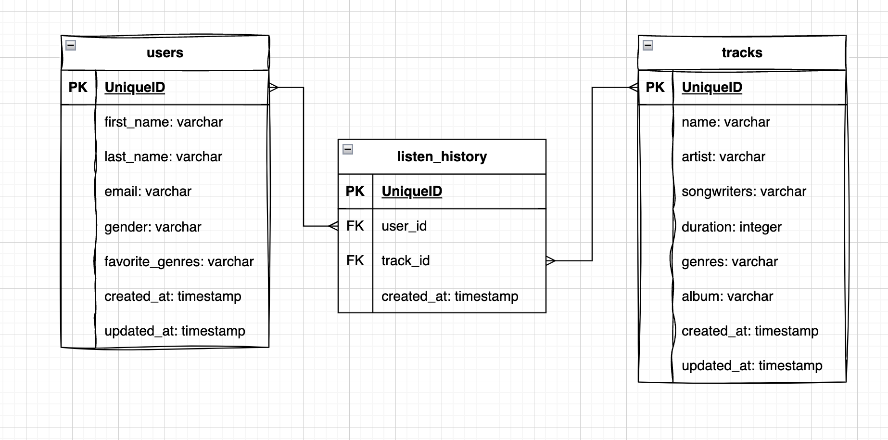
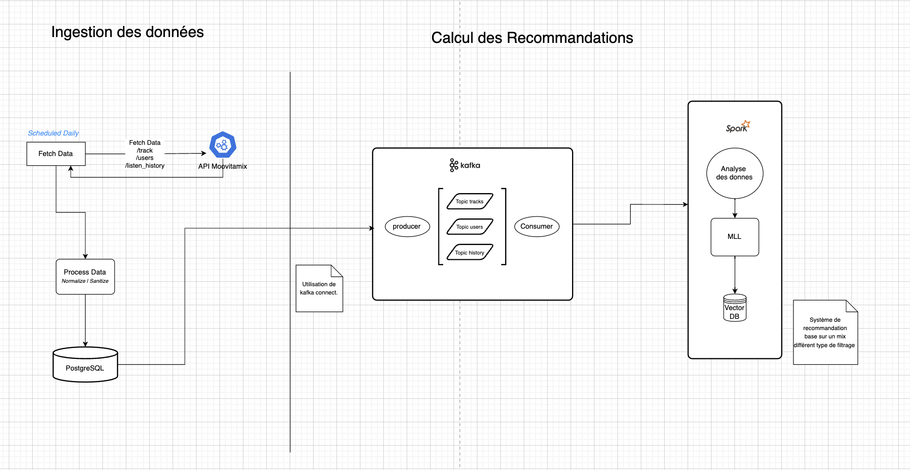

# Réponses du test

## _Utilisation de la solution (étape 1 à 3)_
Pour lancer le serveur, déplacez-vous dans le dossier src/moovitamix_fastapi
1. Installer le recommandation: pip install -r requirements.txt
2. activer l'environnment virtuel: source myenv/bin/activate 
3. lancer l'applicaiton: python -m uvicorn main:app

L'application va starter le scheduler d'Ingestion. Une premiere ingestion sera effectuer et storer dans des dataframes.
Les logs devrait indiquer le succes des 3 appels API.

_Inscrire la documentation technique_

## Questions (étapes 4 à 7)

### Étape 4
Pour stocker les informations récupérées des trois sources de données (tracks, users, listen history) 
une base de données relationnelle tel que PostgreSQL serait utilisé pour préserver la structure relationelle des donnés.

### Étape 5

Pour suivre la santé du pipeline, quelques outils peuvent être mis en place:
- Logs: Permet de capturer les erreurs qui surviennent lors de l'ingestion des données.
- Monitoring: Des outils tel que Sentry, Datadog, Kibana vont servir d'interface visuel pour surveiller et analyser les logs.

Métriques Clés à Suivre:
- Surveillance: 
  - Monitoring des erreurs.
  - Suivie des appels API externes.
- Performance: le temps d'exécution du pipeline 
- Fiabilité: Taux de reussite de l'ingestion des ressources
- Ressource CPU: utilisation des ressources CPU

### Étape 6

Architecture du Système de recommnadation

### Étape 7
Réentrainement du modèle de recommandation

Le réentrainement peut se faire de façon manuel ou automatique.

Un réentrainement périodique peut etre planifier quotidiemment, hebodamadairement ou mensuellement selon le type de  
model de filtrage. 
Par exemple, vu que les gout des utilisateurs peuvent etre assez constant dans leur gout musical, on peut laisser a la machine le temps d'ingerer beaucoup de donnee et de l'etudier avant de proposer de nouvelles recommandations.  
Le systeme peut aussi recommander de nouvelles tracks plus rapidement selon l'activiter de l'utilisateur si il detecte un changement drastique dans son comportement.

